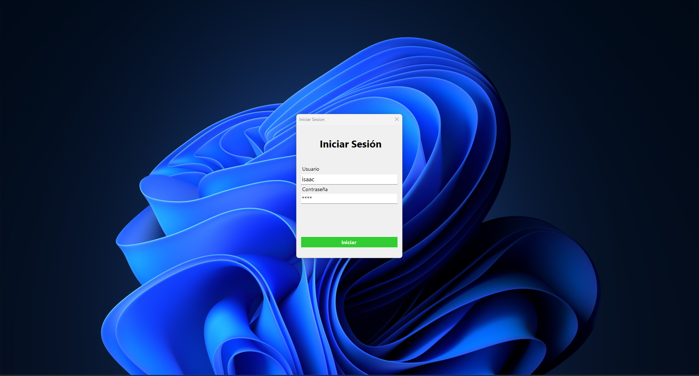
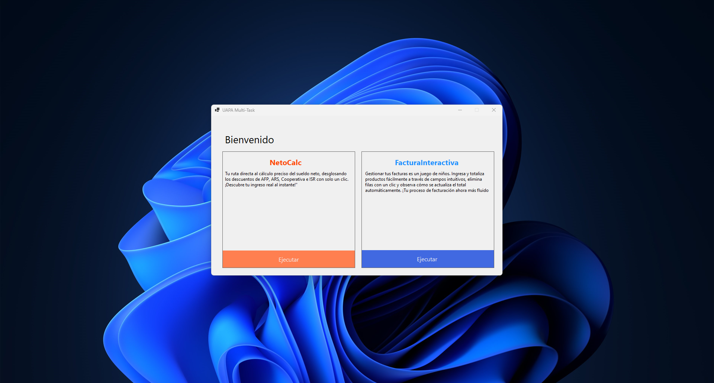
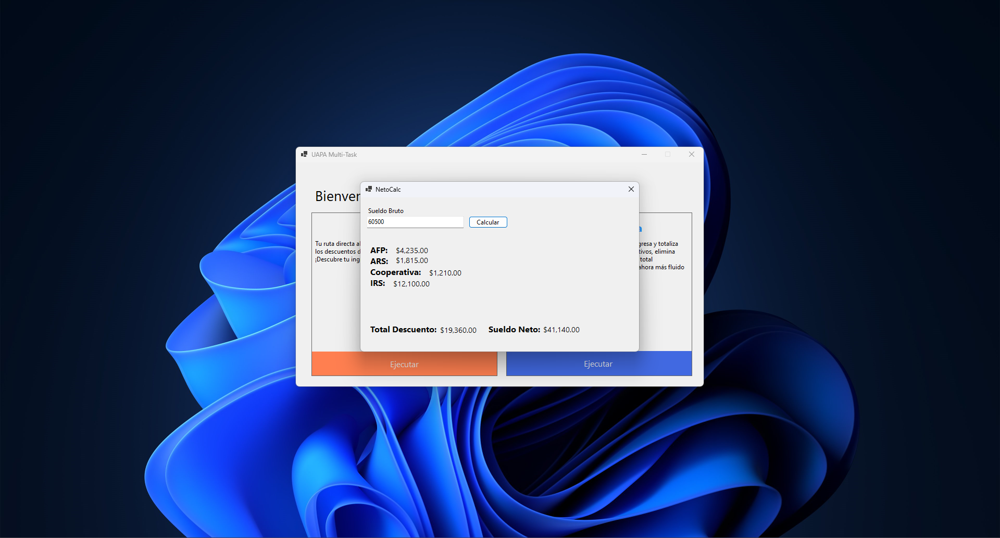
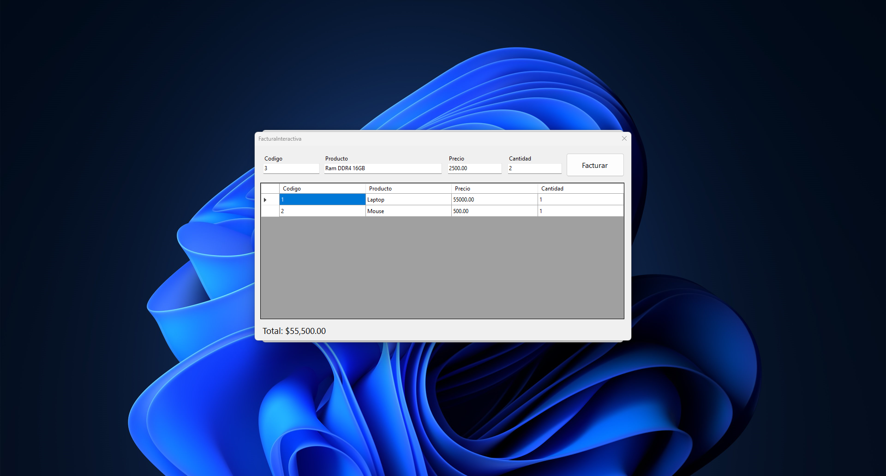

# Final Degree Project - Programming II

This is the final degree project of the Programming II subject. The project is divided into four points, aimed at testing the programming skills acquired throughout the course. The last three points, which form the development aspects of the project, are described as follows:

- Point #1: Investigation and personal opinionl.
- Point #2: Create a program to determine an employee's net salary.
- Point #3: Create a form to simulate the operation of an invoice.
- Point #4: Create a login and integrate it into the previous points.

## Screenshots

    

        
    

    

        
    

    

        
    

    

        
    

